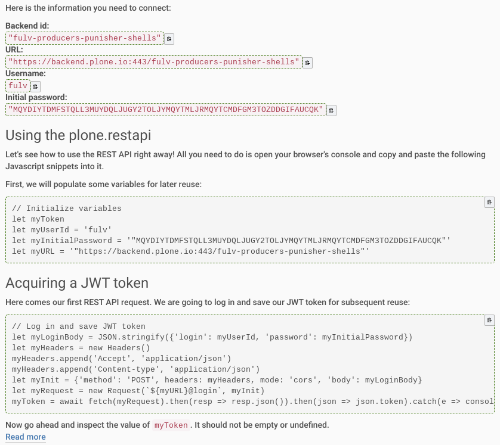

.. This README is meant for consumption by humans and pypi. Pypi can render rst files so please do not use Sphinx features.
   If you want to learn more about writing documentation, please check out: http://docs.plone.org/about/documentation_styleguide.html
   This text does not appear on pypi or github. It is a comment.

========================
collective.pat_clippable
========================

This mockup pattern decorates any element with a button for one-click copying to the clipboard.

Features
--------

- Any element with class `.pat-clippable` will get a clipboard button
- Clicking the button will copy the content of the element to the clipboard
- Some styling is applied to indicate what content will be copied
- TinyMCE gets a *Clippable* format in the **Formats -> Inline** menu
- Based on https://clipboardjs.com/

Examples
--------

.. This add-on can be seen in action at the following sites:
.. - Is there a page on the internet where everybody can see the features?

Installation
------------

Install collective.pat_clippable by adding it to your buildout::

    [buildout]

    ...

    eggs =
        collective.pat_clippable

and then running ``bin/buildout``.
Finally, activate it in Plone's Add-ons control panel (``/prefs_install_products_form``).

Contribute
----------

- Issue Tracker: https://github.com/collective/collective.pat_clippable/issues
- Source Code: https://github.com/collective/collective.pat_clippable

Support
-------

If you are having issues, please let us know by filing an issue in the issue tracker.

License
-------

The project is licensed under the GPLv2.

Compatibility
-------------

- Tested on Plone 5.2, should work on 5.x.
- Not compatible with Plone 4.x.  Could be made to work with plain old JQuery and no patterns.

Thanks
------

Thanks to Verus Technology Solutions (https://www.verustechnology.com/) for sponsoring the first version of this add-on.
